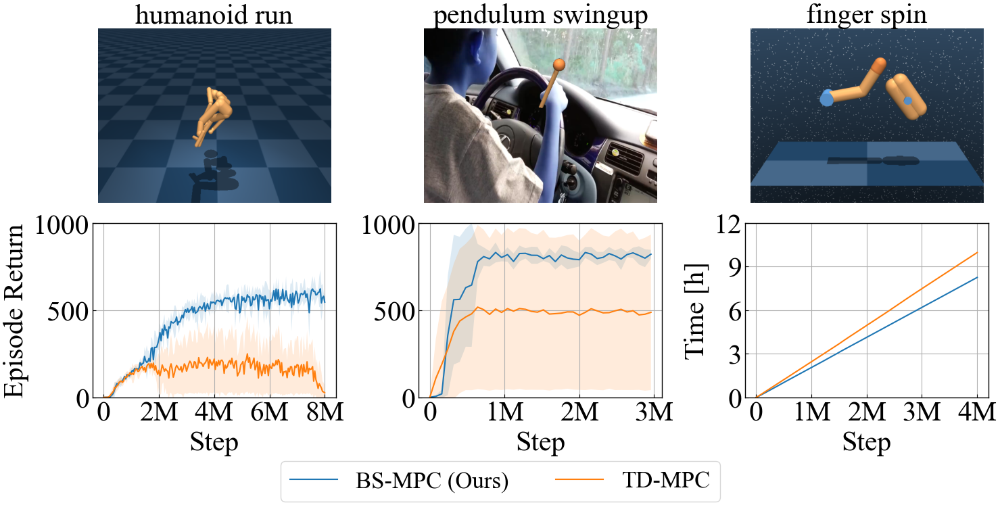

# Bisimulation Metric for Model Predictive Control (BS-MPC)

## Description

This is the official repository for BS-MPC.

## Overview

BS-MPC is a model-based reinforcement learning algorithm that uses sampling-based MPC to get the optimal action. By integrating bisimulation loss in its loss function, it sets apart from TD-MPC. Especially, BS-MPC addresses three open problems in TD-MPC, and the results are shown in the following image.



## Installation

First, create the environment.

```bash
conda create -n bsmpc python==3.11.5 pip
conda activate bsmpc
```

Then install dependencies using pip.

```bash
pip install -r requirements.txt
```

## How to run the code

Parameters for each environment can be found in config directory.

### 1. State-based tasks

- BS-MPC

```python
python main.py --config config/dmcontrol/state/humanoid_run/bsmpc.py --seed 0
```

- TD-MPC

```python
python main.py --config config/dmcontrol/state/humanoid_run/tdmpc.py --seed 0
```

For different environment, change `humanoid_run` to the target task.

### 2. Image-based tasks

- BS-MPC

```python
python main.py --config config/dmcontrol/pixel/walker_run/bsmpc.py --seed 0
```

- TD-MPC

```python
python main.py --config config/dmcontrol/pixel/walker_run/tdmpc.py --seed 0
```

### 3. Image-based tasks with distractors

To reproduce our results, download 'driving_car' videos from the Kinetics 600 training dataset. You can find instructions for downloading the dataset from [here](https://github.com/cvdfoundation/kinetics-dataset).

After downloading the video, please make a folder in the following way.

```bash
cd BSMPC
mkdir distractor_video
cd distractor_video
mv downloaded_videos distractor_video
```

After making the video, you can run the following command to reproduce the result.

- BS-MPC

```python
python main.py --config config/dmcontrol/distractor/walker_run/bsmpc.py --seed 0
```

- TD-MPC

```python
python main.py --config config/dmcontrol/distractor/walker_run/tdmpc.py --seed 0
```

## Credits

Some codes in this repository come from the following open-source projects. We appreciate these authors to share their valuable codes.

- [TD-MPC](https://github.com/nicklashansen/tdmpc)
- [TD-MPC2](https://github.com/nicklashansen/tdmpc2)
